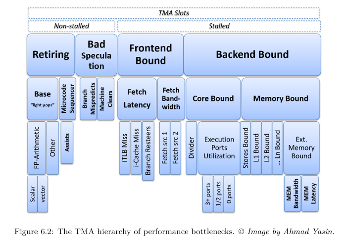
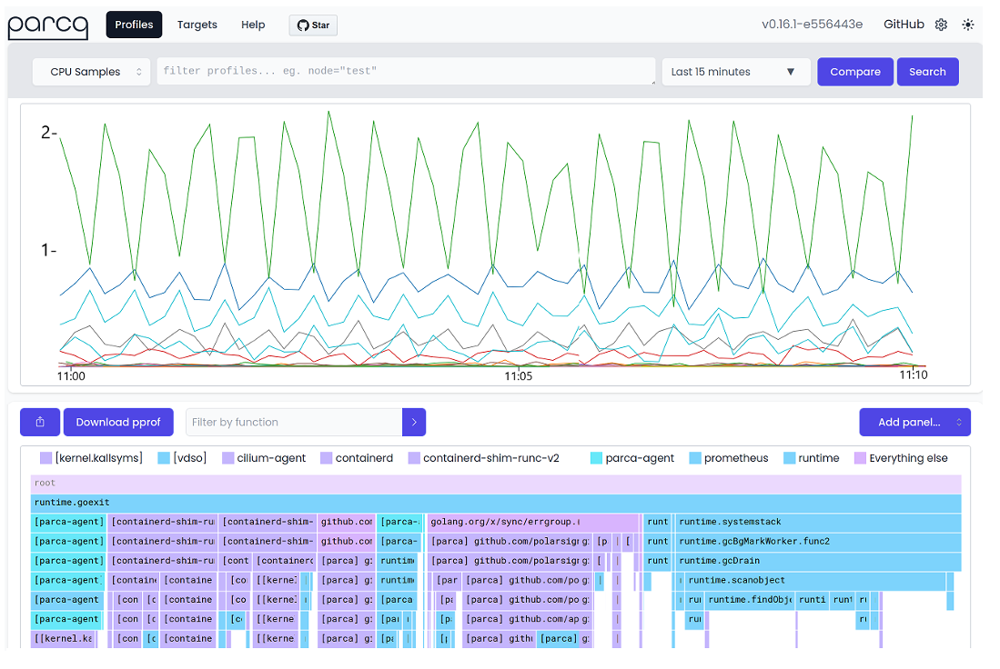
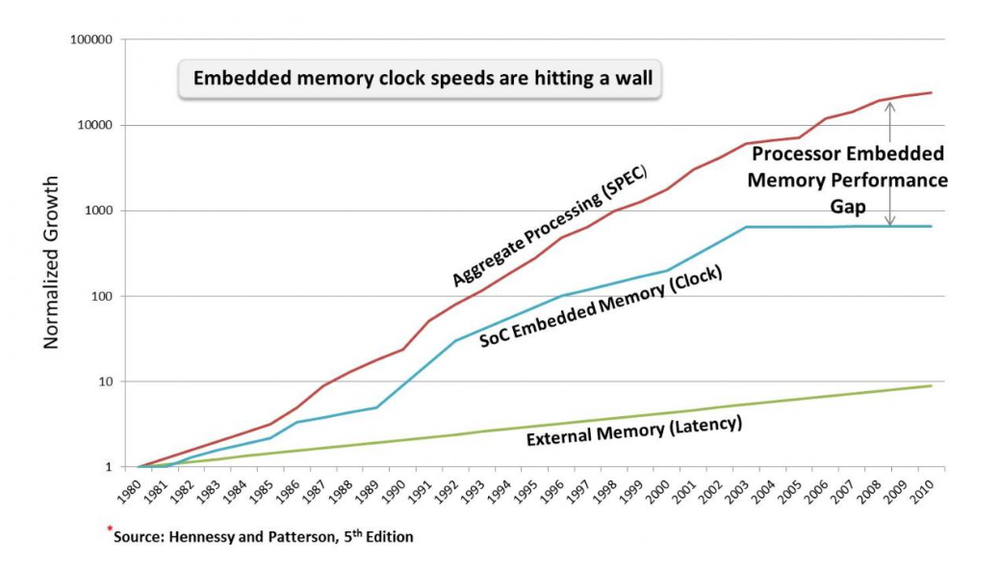
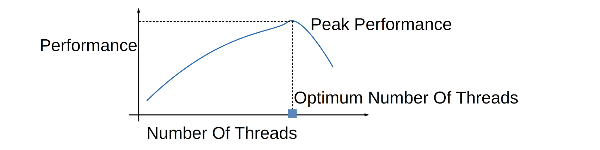
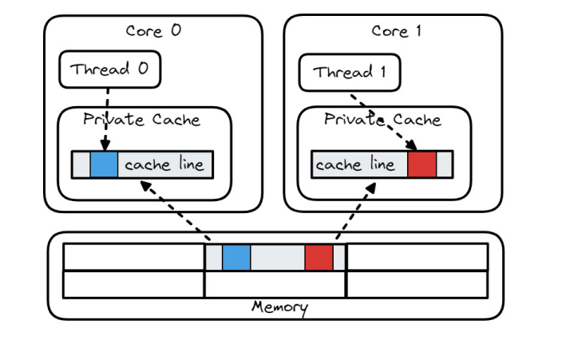

# Performance Bugs

A program's performance can decline due to various reasons, from excessive memory access to inefficient loops. It is essential to diagnose the bug that is causing the issue before making any modifications to the program. There are various tools that can be utilized to diagnose the issues.

---

## Performance Monitoring Units

 PMUs (Performance Monitoring Units) are parts that are integrated into the hardware to track hardware events such as cache misses or branch mispredictions. However, on its own, it tends to be a challenge to identify which of the events actually causes the performance declines. That is why tools such as Intel Vtuner are used to give a predefined set of events to use as a reference. Through these events, it is possible to narrow down on the hotspot functions.

Current modern CPUs implement pipelining to use hardware resources in the most effective way possible. Unfortunately, there are situations where the pipeline is completely idle without any instructions being executed, which causes performance decline. By using TMA (Top Down Microarchitecture Analysis), it is possible to find the dominant performance bottlenecks in the application. It is also possible to find out how many of the CPU pipelines are being used for the application.

Modern CPU pipelining is divided into frontend and backend components. The frontend is what fetches the program code and decodes it into instructions. It also breaks down the code into lower-level hardware operations called micro operations. A micro operation (or µop) is the CPU’s internal mini-instruction. A majority of x86 instructions decode into one or more micro operations that the core is able to schedule, execute, or retire. The frontend then feeds the backend the micro operations, which is a process called “allocation”. The backend executes the operation on an available unit. Once the operation is executed, it is considered “retired.” Most of these processes end up retired, but some get cancelled due to branch mispredictions or other related issues.

On average, Intel’s CPU frontend is able to allocate, and the backend is able to execute 4 micro operations per cycle. TMA makes the assumption that there are 4 pipelines for each core of the CPU.


### **Pipeline Stalling**

When a pipeline slot is empty during a cycle, it is considered a stall. PMU events are able to show if the stall is due to a frontend or backend failure. 

- If the frontend is the cause of the stall, it is referred to as frontend bound. It is due to the frontend’s inability to fill a slot with a micro operation. 

- If a backend is the cause of the stall, it is referred to as a backend stall. It usually indicates the backend running out of resources, resulting in a stall.

- If a micro operation does not retire at all, it is called bad speculation. It can be caused by branch mispredictions. 

- Lastly, if a micro operation is complete, it is considered retired.

- In cases when both the frontend and backend are causing the stall, it is considered a backend bound. This is due to the fact that fixing the frontend will not alleviate the situation, since the backend bottlenecks the performance.


As seen above in the diagram, pipelining can be divided into 5 different stages. 

- Fetch (IF)
- Decode (ID)
- Execute (EX)
- Memory (MEM)
- Writeback WB)

Fetching indicates the processor receiving instructions. The processor then decodes this instruction into micro operations in the decode stage. This micro operation is then executed in the execute stage. Data is read during the memory stage and, if required, the memory is then committed in the writeback stage. The writeback and the memory stage can technically be combined into a single process, since it can be generalized to load and store memory.


A pipeline can be fetching instructions while the other pipeline decodes or executes another instruction. In essence, multiple processes can instructions can happen at once. Non-pipelined systems would result in one instruction waiting for another instruction to complete, which results in significant delays. Having multiple instructions run concurrently results in better utilization of the resources.

In cases where there are branches in the code, branch instructions can take a significant amount of time to execute. Often, the branch is determined later in the processes, such as decode or execute. A branch prediction is made based on previous executions to avoid waiting for the branch before fetching the instruction. Issues might arise if the branch hasn’t been determined until the execution state. This is due to the fact that memory is read and committed in the following stages. A clear decision has to be made whether the branch is mispredicted or not.
  
---
## Micro ops

One detail that matters when you start looking at PMU counters is that the CPU does not directly execute your x86 instructions. The frontend first decodes them into micro-operations (µops), which are the smaller internal steps the core actually schedules and runs.

A single x86 instruction can expand into multiple µops. For example, a memory add like:

```
add dword ptr [rdi], eax
```

is effectively doing a load, an add, and a store, so it may decode into 3 micro ops:

```
µop 1: load [rdi]
µop 2: add with eax
µop 3: store back to [rdi]
```

---

## TMA Hierarchy / Slot Buckets

TMA (Top-Down Microarchitecture Analysis) uses PMU events to estimate how the CPU’s pipeline slots are being used, then reports the result as fractions of total throughput. The idea is simple: every cycle has a limited number of pipeline slots where useful work could have happened, and TMA tells you where those slots went.


At the top level, TMA groups pipeline slots into four buckets (If you need more detail, you travel down the TMA hierarchy to break a broad category into more specific causes):

- **Frontend bound:** slots are empty because the frontend is not delivering µops fast enough (fetch, decode, or instruction supply problems).

- **Backend bound:** µops are available, but the backend cannot make progress (often waiting on memory or limited by execution resources).

- **Bad speculation:** the CPU did work that got thrown away, most commonly due to branch mispredictions, so those slots did not produce retired results.
Retiring: useful work that is actually completed and committed to the CPU’s architectural state.

This breakdown immediately tells you whether you should be thinking about instruction supply (frontend), execution and memory behavior (backend), branch behavior (bad speculation), or whether the core is mostly doing productive work (retiring).



---
## Causes for Each Pipeline Stall Category

### **Backend Bound**

Backend bound issues are usually due to the backend running out of resources to execute, causing latency. Backend bound is divided into memory-bound and core-bound issues. For the most part, backend bound issues are under memory bound. Cache misses and memory accesses usually cause a high memory-bound. 

### **Front-End bound**

Frontend bound is mostly due to the frontend’s inability to fill a slot with a micro operation. It is broken down into latency and bandwidth. Latency occurs when there are no micro operations being issued by the frontend while the backend is waiting for any instructions. Bandwidth is from having less than 4 micro operations issued per cycle, which is an inefficient use of the frontend. This is because it is assumed that 4 micro operations are being issued per cycle, and under 4 micro operations per cycle indicates resources being underutilized. 

### **Bad speculation**

Bad speculation is mostly by micro operations not retiring. It is usually caused by branch mispredictions. The pipeline is busy fetching and executing operations that end up being useless. Branch mispredictions can also happen due to error handling. This would be cases such as try-catch statements to catch errors that might happen in the code. These cases are uncommon and often unintended, and aren't necessarily negatively affecting the performance.

### **Retiring**

Lastly, once a micro operation is executed, it falls under the retiring category. The results of the micro operation are committed to the architectural state, which are either CPU registers or main memory. In ideal cases, a majority of the pipelines fall under this category, since it means that useful work is actually being committed to memory.

The question is how much of each category is considered “good” for a program. Intel recommends around 50% retiring with 20% backend bound for client or desktop applications, with lower ranges of 10 ~ 30% retiring for server, database, or distributed applications.


---

## Resolving Bugs in Each Pipeline Stall Category

### **Backend Bound Issues**

The majority of issues will be back-end bound. To begin, you want to first determine if the issue is core-bound or memory-bound, which can be determined using the various tools mentioned later in this week's summary.

For memory-bound issues, which are the most common, there are several solutions depending on the issue.

- Latency Bottleneck
  - Use prefetching to bring data into the cache before the CPU asks for it.
- Improving Throughput
  - Use batching/tiling to process data into chunks that fit into the L1/L2 cache to avoid constant trips to RAM.
  - Have more spatial locality by ensuring that data is stored sequentially in memory
- Data Layout
  - Make hot data smaller by using SoA, which is a structure of arrays rather than an array of structures. This is better for vectorization.
  - Use smaller data types if possible
  - Split structs into hot and code structs. Rarely used data (cold) should be kept out of the main structure to keep frequently accessed data (hot) compact and cache-friendly.

Core-bound issues typically occur when the CPU is limited by its use of execution units or the speed of the instruction dependency chain.

- Compute Limits:
  - Reduce complexity by moving expensive operations out of hot code blocks
  - Vectorization: use SIMD (single instruction, multiple data) to perform the same operation on multiple data points simultaneously 
- Dependency Chains
  - Use multiple accumulators to break up dependency chains for expensive operations. This can be done through using separate variables to store intermediate results of a calculation. 
  - Use the -O3 flag

> **A note about the -O3 flag:**
> The compiler will perform helpful optimizations like loop unrolling and vectorization **ONLY** when it can ensure that it is fault-proof. If it cannot guarantee that its optimization will not change how the program functions, it will not optimize. Therefore, when using the -O3 flag you should ensure that your code is optimizable (or do the optimizations you expect yourself)

### **Frontend Bound Issues**
Front-end bound issues are less common to be the program’s bottleneck, but there are still several cases that may occur. Here are some of the most common to keep mind of:

- JIT issues
  - Just-in-time compilers create instruction streams dynamically at runtime, so the instructions can be scattered in memory and lead to higher cache pressure and more iTLB misses. 
- Optimizing Code Layout
  - Similar to resolving memory-bound issues on the back-end, you should try to reduce iTLB misses by moving rarely-used (cold) code out of the main execution path. Some examples are error handling, logging and debug checks.
  - -O3 flag: When utilized correctly, the compiler can perform function reordering and basic block placement to reduce the amount of branching and mispredictions

### **Bad Speculation Issues**

These issues are caused when the CPU does wasted work by mispredicting branches. It then has to throw the work away if the prediction was incorrect, causing stalls in performance.

A few ways to prevent these issues:

- Optimize Branch Predictions
  - Reorder conditional statements so that the most common case is first
  - Move cold paths out of hot loops, such as error handling or edge case checks that can be moved elsewhere
  - The -O3 flag, again, can arrange the binary so that the likely path will be a straight fall-through
- Eliminate machine clears
  - Occurs through the reset of a pipeline, such as the CPU speculating an access to a memory address that isn’t currently mapped in TLB or Ram.

---

## Continuous Integration Approach

Another approach to diagnosing your performance bugs should be from a Continuous Integration (CI) perspective. Especially if you’re working on bigger projects or with a team. CI tools allow you to view the performance of your program over time as it evolves. We specifically want to mention some git-based tools (Gitlab pipelines and Git bisect), and another type of tool which fits into this same category (Continuous Profilers).

### **Gitlab Pipelines** 
Gitlab Pipelines (and CI/CD pipelines in general) operate by automatically running a set of jobs on a machine of your choice every time you push a commit, open a merge request, or trigger a scheduled run. Through this, we can schedule benchmarks to run for each commit made. The pipeline is defined in a .gitlab-ci.yml file pushed to your repository, where you decide what commands run and what outputs get saved. Gitlab can store these benchmarking results for you to review whenever you need them. Pipelines provide three big benefits: they help you pinpoint exactly which commit introduced a performance regression, they run benchmarks in a standardized environment (especially helpful in team projects where everyone’s PC specs differ), and they execute automatically at push time so results are captured without manual effort. More details about how to configure a pipeline on gitlab: [Gitlab Docs: CI/CD YAML syntax reference
](https://docs.gitlab.com/ci/yaml/)

One catch is that not all runner machines are good benchmarking machines. Shared runners (or busy lab machines) can be noisy and dev boxes (local dedicated development PC) may not have the specs you want for testing production code. A good compromise is to treat CI benchmarks as a regression detector, rather than precise measurer. I recommend running benchmarks on a dedicated self-hosted runner with stable hardware and running multiple iterations to weed out variations as best as possible.


### **Git Bisect**

One downside of relying on CI runners for performance monitoring is that runner machines can be inconsistent: they might be shared, busy, or simply not an ideal production environment. This allows machine variation to be mistaken as performance regression. A better approach may be using a Git Bisect command.
Git Bisect is more of a dedicated benchmarking session. You can more easily pick a stable, less busy, more powerful/production-ready machine to run benchmarks on a set of past commits to identify exactly which commit a performance regression occurred.

Git bisect is essentially a binary search over your commit history. You tell Git one commit you know is good (performance is acceptable) and one commit you know is bad (performance is regressed). Git then checks out a commit roughly halfway between them. You test that commit (in this case: build + run the benchmark). If it behaves like the “bad” version, you mark it bad; if it behaves like the “good” version, you mark it good. Git repeats this process, halving the search space each time, until it isolates the first commit where the regression appears. The binary search approach allows only benchmarking around log2(N) steps instead of benchmarking every commit in a long history (so 128 commits is ~7 tests).

For performance debugging, you can go one step further and use “git bisect run”, which automates the loop. You write a script that builds the program, runs the benchmark, and exits with a status code that means “good” or “bad” based on a threshold (for example, “median runtime must be under X ms” or “throughput must be above Y ops/s”). Then Git drives the binary search automatically, checking out commits and calling your script until it finds the culprit commit.


### **Continuous profiling**
Continuous profiling is like a CI pipeline for runtime performance data: instead of only benchmarking at push time, a continuous profiler continuously collects CPU samples and stack traces from the processes running on a host, then stores them so you can inspect performance over long time windows. This is especially valuable for distributed systems, where performance bugs often show up as intermittent latency spikes that don’t reproduce in a local test.
The idea is: a change gets merged into production, you later see reports of response-time spikes, and then you open the profiler’s web UI to jump directly to the time range of those spikes and compare the collected stack traces against “normal” periods. Many tools support this as a built-in visual diff (similar to a differential flame graph), which helps you identify what code paths (or kernel activity) became unusually hot during the incident. Examples of continuous profilers include Google Cloud’s Continuous Profiler, AWS CodeGuru Profiler, Datadog Continuous Profiler, Parca (open source), and Intel’s Granulate/gProfiler (recently open-sourced).



---

## Memory and Microprocessor Speed

Over the years, processor speed has increased significantly, while memory speed hasn’t improved much. Memory latency has been introduced due to the memory performance falling behind.



### **How Memory Latency is Addressed**

The main question is how this memory latency is addressed. No matter how fast the CPU becomes, it would always be bottlenecked by memory to a certain degree. There are several factors that help alleviate this problem. One of them is prefetching, where the required memory is  predicted and fetched ahead of time. Another factor are compiler optimizations. Compiler -O1, -O2, and -O3 flags apply techniques such as code motion and loop unrolling to reduce accesses to memory, thus reducing memory latency. Lastly, multi-level caches are used to reduce the need to bring data from main memory. 

---

## Multithreading

Despite the previous methods mentioned above, the CPU may still be stalled waiting for memory. Multithreading is a technique used to take advantageof the waiting time. It allows a single process to execute multiple tasks (or threads) concurrently.


The processor can hold the state for several different threads at the same time, which gives support for multiple contexts. This results in fast context switching because threads share the same address space, so page tables do not need to be switched, and the cache does not need to be flushed. The CPU only needs to save and restore registers and program counters. Therefore, this generally results in a better performance because other threads can continue processing if one thread hits a memory bottleneck.

It is important to note that in order to use multithreading properly, you should make sure that threads are not dependent on the results of other threads, or that multiple threads are modifying the same resource as others at the same time. If one thread is constantly waiting for another, it takes away the point of concurrency in the first place.

### **Multithreading Example**

**Q:** Take a look at this small piece of code performing dense vector addition. What would be a simple way to use multithreading to make this more efficient?

```C
for (int i = 0; i < 1000000; i++) { 
     C[i] = A[i] + B[i]; 
}
```

**A:** A quick and simple answer could be to split the workload of the code into 2 separate loops where 2 threads can perform the addition at the same time. While one thread may be stalled waiting on memory access, another thread can work on accessing a different piece of memory.

```C
void thread_one() {
    for (int i = 0; i < 1000000; i += 2) {
        C[i] = A[i] + B[i];
    }
}
```

```C
void thread_two() {
    for (int i = 1; i < 1000000; i += 2) {
        C[i] = A[i] + B[i];
    }
}
```

However, would we want to split this up between more than 2 threads? Is there a correct number of threads to get the best performance?

It would not be wise to create as many threads as possible. More threads give diminishing returns and would result in two threads fighting over a cache line or possible load imbalance, which will be discussed later in this summary. Additionally, if you have more threads than physical CPU cores, the overhead of switching between them may actually start to make the program slower.


A general rule of thumb to follow is to use up to the number of physical CPU cores for multithreading. In terms of splitting up tasks, you should consider an nlogn breakdown of work to get the sweet spot between load imbalance (too few tasks, not evenly distributed) and queue contention (too many tasks, large overhead).

---

## Multithreading Vs. Multitasking

One topic we wanted to touch upon is the difference between multithreading and multitasking, which can often get mixed up or used interchangeably. Here’s a quick clarification between the two:

- Multitasking
  - The operating system schedules times and orders for processes or programs to complete
  - Prevents a program from crashing due to another program crashing
- Multithreading
  - Occurs within the process itself
  - Creates parallelism within the process to keep the CPU busy while a thread is stalled by memory access

---

## Diagnosing Performance Issues while Multithreading

As stated earlier in the multithreading example, there usually isn’t a single “correct” number of threads. Performance tends to improve up to a point, then you hit diminishing returns (or even regress) as overhead and resource contention start to dominate. Once you’ve found where throughput plateaus or peaks for your workload, the next step is to diagnose why it stopped scaling.

A first check could be a quick baseline of CPU utilization and general counters:

```powershell
perf stat -d ./your_program ...
```

If utilization is low, threads are likely inactively waiting through locks or I/O. If utilization is high but scaling is poor, you’re often burning cycles on active locks, cache coherence between threads, shared data structure contention, or penalties from NUMA rather than useful work. At that point, you can narrow down the most common culprits with targeted tools:

Lock contention (if threads spend time blocked on mutexes/spinlocks):

```powershell
perf lock record ./your_program ...
perf lock report
```

Thread oversubscription (if you have too many runnable threads leading to frequent context switching):

```powershell
perf sched record ./your_program ...
perf sched latency
```

Syscall-heavy behavior:
```powershell
perf trace ./your_program ...
```

Suppose CPU utilization is high, but adding threads still doesn’t help. A good default assumption is cache coherence / shared-data contention. So the threads are busy, but they’re busy invalidating and reloading shared cache lines (hot atomics, shared queues, shared counters). In that case, use tools that point directly at shared structures:

```powershell
perf c2c record ./your_program ...
perf c2c report
```

Call stack sampling can also help you see where the hot shared operations come from:

```powershell
perf record -g ./your_program ...
perf report
```

At the same time, check whether the work is even balanced. If one thread is pegged and the others are mostly idle, the program can’t scale no matter how many threads you spawn:

```powershell
top -H
# or
pidstat -t 1
```

Aside from these specific commands to pinpoint specific multithreaded issues. You likely want to consider how thread placement can introduce noise that looks like “random performance.” Pinning threads during experiments so scheduling doesn’t dominate the measurement can help you achieve more consistent and accurate results:

```powershell
taskset -c 0-7 ./your_program ...
```

Finally, NUMA. If you’re on a multi-socket machine, it’s possible your system uses NUMA (Non-Uniform Memory Access). A NUMA node is a group of cores with memory that is “closer” to them. If a thread runs on node 0 but keeps reading pages allocated on node 1, every access becomes a remote trip over the interconnect. This ties in closely with the conversation on performance and accessing memory as physically close to the CPU as possible. A clean way to test NUMA sensitivity is to bind both CPU and memory:

```powershell
numactl --cpunodebind=0 --membind=0 ./your_program ...
```

If NUMA matters, the fixes are usually architectural, where threads should ideally touch only their own memory. This idea is important in optimizing performance while multithreading and should be talked about extensively in this website's chapter on multithreading, but we also touch on it more in the section below, as well as the section on false sharing.

---

## Common Performance Mistakes While Multithreading

We want to go over some of our own performance mistakes while multithreading as most multithreading problems come from the same handful of mistakes people keep re-discovering. Keep these sources of error in mind while writing your own concurrent programs.

### **False Sharing**
False sharing happens when multiple threads are writing to different variables, but those variables happen to live in the same 64-byte cache line. Because caches move data around in cache-line chunks, the whole line gets passed back and forth between cores, which slows both threads down.

### **Load Imbalance**
This is where the work isn’t split evenly between threads. One thread gets stuck with more work (or harder work), and everyone else finishes early and waits. Your speed ends up being limited by how long the slowest thread took.

### **Shared Structures**
Where one work queue, one counter, one hash table bucket, or one logging buffer are accessed often by multiple threads and we end up spending a lot of time coordinating threads with locks and this shared spot can become a traffic jam.

### **One Big Lock**
A lock protects a large region of code or a big shared structure. Only one thread can enter at a time, so again, threads spend time blocked instead of doing work.

### **Too Many Threads / Too Many Tiny Tasks**
You create more runnable threads than cores, or you split the work into extremely small pieces. The machine spends a lot of time scheduling, waking threads, switching contexts, and moving work around instead of computing.

### **Lots of Barriers / Program Phases**
Threads are forced to meet up at checkpoints over and over. Again, your speed ends up being limited by how long the slowest thread took.

### **NUMA**
Again, memory is physically closer to certain cores. If a thread runs on one socket but keeps reading data that lives in RAM attached to the other socket, those accesses are much slower.

### **Heisenbugs**
Heisenbugs are bugs that depend on timing. The program fails when running normally, but once you add print statements, debugging, or profiling, the timing changes and the bug disappears. These bugs almost always indicate that your program is incorrect under concurrency (watch out for a data race, improper lockings, or other undefined behavior).

---

## Hyper-threading

Hyper-threading makes it possible for processors to run instruction threads on several threads on a single core. The key idea of hyper threading is by having threads share caches and cores, it would use more of the resources and result in better performance.


This is a diagram taken from Intel’s hyper-threading manual. They indicate that hyperthreading is very different in nature compared to dual cores. The threads evidently share the same cache and processor cores while dual cores each have their own caches and processor cores.

### **Benefits of Hyper-Threading**

There are several benefits associated with hyperthreading. As indicated before, it reduces the amount of idle execution units, which ultimately uses more of the resources efficiently. By using resources effectively, it also, in turn, reduces the memory latency.

The main objective of hyperthreading is to increase the use of processor resources.

According to Intel, a generic application would use 35% of the processor resources, which is considered pretty inefficient. Using hyperthreading, it is possible to increase the resource utilization to above 50%. This is due to the fact that, instead of executing operation threads one by one, it is running operations in parallel.

### **Considerations to Make While Using Hyper-Threading**

Although hyperthreading might seem like the solution to every problem, and would solve all memory latency issues, there are some factors to take into consideration.

### **Bus Optimizations**

There are some issues that can happen due to multithreading, which also applies to hyperthreading. One of them is bus optimization. Multithreading can potentially increase overall bus traffic, which leads to a performance decline.

Intel mentions that keeping track of bus utilization tends to be a challenge with multithreading or hyperthreading.

Some of the methods introduced are:

- Keeping code or data locality
- Reducing the use of prefetch instructions
- Increasing back to back memory reads in the code

Overall, keeping spatial locality seems to reduce bus utilization, which, in turn, improves hyperthreading performance.

### **Frontend Optimizations**

On top of bus optimizations, frontend seems to also need optimizations in order to increase performance on hyperthreading. 

One of the more surprising suggestions made on Intel hyperthreading was to not unroll loops excessively. This was due to the fact that reducing unnecessary loop unrolls results in higher efficiency of the trace cache. For reference, a trace cache is a cache that stores dynamic instructions.  

Loop unrolling is one of the optimizations that can be made by the compiler. It doesn’t affect the functionality of the code itself and is intended to increase performance of the code.

Intel also suggests reducing the overall code size. This increases the locality of the trace cache, which also increases performance.

### **False Sharing, Again**

Lastly, a concern introduced by hyperthreading is false sharing.

False sharing occurs when two threads share a cache. However, the two threads have different data on the same line of cache. Cache evictions happen in order to keep cache coherency.

This happens especially often due to the very structure of hyperthreading, where two threads share the same processor and cache.



Intel recommends using their VTune profile to identify false sharing in the code. By finding and keeping separate copies of data for each thread, it is possible to prevent false sharing.

---

## Execution Environments Thought Experiment

Imagine you run two micro-benchmarks back-to-back:

```powershell
./benchmark --test_func_a
./benchmark --test_func_b --v1
```

Now imagine func_a and func_b are literally identical code. Why might the second run still be faster (or slower)?

CPU caches don’t reset between runs. If both benchmarks share startup code, the second run may benefit from warmed-up instruction cache, data cache, and even warmed-up branch prediction. On the other hand, small differences in where the code or data lands in memory can change things too. If func_a and func_b live on different virtual memory pages (usually 4 KiB chunks), one run might incur an iTLB miss (address translation not cached) or an i-cache miss (instructions not cached) that the other doesn’t.

Even if the code is identical, background processes can run during your measurement window, causing noise through contention and context switching. 

A surprising source of variation in tiny benchmarks is the process environment and startup state. Even a flag that does nothing extra like --v1 can change the initial stack layout by slightly changing what gets placed on the stack at program start. That shift changes stack addresses, which can change alignment and cache behavior especially in small benchmarks.

Finally, if you’re benchmarking in the cloud or inside a VM/container, your “CPU” is often sharing hardware with other users. Cloud providers may impose QoS controls (for example, partitioning or throttling shared resources like the last-level cache), and neighboring workloads can create performance variation even when your code doesn’t change.

### **How do we avoid these sources of variation in our benchmarks?**
Our advice is to try to keep the environment as consistent as possible and we recommend using Docker as a tool to help accomplish this. You should also be cautious micro benchmarking a lot of small functions / code flows inside one giant binary. If you want to get closer to a true fair comparison between two pieces of code consider compiling them into their own binaries. Additionally, consider using a benchmarking harness (a good example is Criterion for the Rust Programming Language). Harnesses typically have built-in warmups and repeated trials to avoid measuring noise. You could also of course design your own “harness” to fit your needs.

---

## Summary of Useful Tools

### **Perf (Linux)**

Useful for diagnosing multithreaded scaling issues, contention, scheduler behavior, syscalls, and coherence problems. For the specific commands and when to use them, refer to the Diagnosing Performance Issues While Multithreading section.

### **Intel VTune**

Hotspots plus microarchitecture analysis (TMA-style stalls, cache behavior) on Intel CPUs.

### **AMD uProf**

Hotspots and hardware-counter analysis on AMD CPUs.
Xcode Instruments (macOS):
CPU time profiling, allocations, and system tracing on macOS and iOS.

### **Flame graphs**

A visualization of sampled call stacks that makes hot code more easy to spot.

### **Coz (causal profiling)**

A causal profiler answers a different question than a normal profiler. Instead of only showing where time is spent, it estimates how much the whole program would improve if a specific line or region were faster.

Coz is a causal profiler that works well for multithreaded programs because it can run while the program stays concurrent, and it tends to perturb execution less than heavy profiling like perf. Rather than collecting lots of high-frequency samples from every thread (as with many perf workflows), Coz uses virtual speedups to estimate payoff and then ranks code locations by predicted impact. This makes it easier to avoid optimizing code that is merely busy, but not actually limiting overall throughput.

### **eBPF & GAPP**

eBPF is kernel-level tracing via small sandboxed programs with lower overhead than heavy logging or instrumentation. GAPP is a profiler using eBPF as a base. It helps find serialization bottlenecks by collecting stack traces from blocked threads and the threads causing the blocking. It importantly can collect data with low overhead (average 4% runtime overhead).

### **Memory Profiling**

- **Valgrind Massif**
  - Heap usage over time (higher overhead, but useful timelines). Also locating memory leaks if they exist in your program.
- **Top**
  - Live Linux system monitor for per-process CPU and memory usage.
- **Heaptrack**
  - Linux heap profiler that records allocation/free events with stack traces.
  - **Memory metrics to know:**
RSS (memory resident in RAM), VSZ (virtual mapped memory), USS (unique to process memory), PSS (shared pages split proportionally).

### **Continuous profiling**

Always-on sampling with stack traces across time, which is useful for intermittent production issues. Examples include Google Cloud Continuous Profiler, AWS CodeGuru Profiler, Datadog Continuous Profiler, Parca, and gProfiler.

---

## References

Bakhvalov, D. (2024). *Performance Analysis and Tuning on Modern CPUs* (2nd ed.). Independently published. https://easyperf.net/perf-book/

Intel Corporation. (2022). "Top-down Microarchitecture Analysis Method." *Intel VTune Profiler Performance Analysis Cookbook*. [Online]. Available: https://www.intel.com/content/www/us/en/docs/vtune-profiler/cookbook/2023-0/top-down-microarchitecture-analysis-method.html

Park, J., Choi, B. & Jang, S. Dynamic Analysis Method for Concurrency Bugs in Multi-process/Multi-thread Environments. Int J Parallel Prog 48, 1032–1060 (2020). https://doi.org/10.1007/s10766-020-00661-3 [Online] https://link.springer.com/article/10.1007/s10766-020-00661-3#citeas

Sarah L. Harris, David Harris, 7 - Microarchitecture, Editor(s): Sarah L. Harris, David Harris,Digital Design and Computer Architecture,Morgan Kaufmann,2022,Pages 392-497,ISBN 9780128200643, https://doi.org/10.1016/B978-0-12-820064-3.00007-6.
(https://www.sciencedirect.com/science/article/pii/B9780128200643000076)
Abstract: This chapter discusses microarchitecture, particularly the design of three RISC-V processors: single-cycle, multicycle, and pipelined RISC-V processors that perform a subset of RISC-V instructions. It also discusses processor performance, dealing with data and control hazards, and advanced microarchitecture techniques, such as superscalar and out-of-order processors.
Keywords: microarchitecture; single-cycle; multicycle; pipelined; processor; RISC-V; hazards; advanced microarchitecture [Online] https://www.sciencedirect.com/science/chapter/monograph/abs/pii/B9780128200643000076 

S. Saini, H. Jin, R. Hood, D. Barker, P. Mehrotra and R. Biswas, "The impact of hyper-threading on processor resource utilization in production applications," 2011 18th International Conference on High Performance Computing, Bangalore, 2011, pp. 1-10, doi: 10.1109/HiPC.2011.6152743. keywords: {Radiation detectors;Instruction sets;Phasor measurement units;Computational fluid dynamics;Hardware;Performance gain;Bandwidth;Simultaneous Multi-Threading (SMT);Hyper-Threading (HT);Intel's Nehalem micro-architecture;Intel Westmere-EP;Computational Fluid Dynamics (CFD);SGI Altix ICE 8400EX;Performance Tools;Benchmarking;Performance Evaluation},[Online] https://ieeexplore.ieee.org/abstract/document/6152743?casa_token=HZ8_L0yUHaEAAAAA:QAESxOTl6EltWOzKy66pHc_AVfaKCaa_T6CFzJGlg4JqFlCOx7CK26ybcIIWoupXw0DCXemINw

Thomas Sterling, Matthew Anderson, Maciej Brodowicz, Chapter 6 - Symmetric Multiprocessor Architecture, Editor(s): Thomas Sterling, Matthew Anderson, Maciej Brodowicz, High Performance Computing, Morgan Kaufmann, 2018, Pages 191-224, ISBN 9780124201583, https://doi.org/10.1016/B978-0-12-420158-3.00006-X.
(https://www.sciencedirect.com/science/article/pii/B978012420158300006X)
Abstract: Symmetric multiprocessing is the most widespread class of shared-memory compute nodes. While nodes of this type can be used as self-contained computers, they serve more frequently as a building block of larger systems such as clusters. This chapter discusses typical components of a symmetric multiprocessing node and their functions, parameters, and associated interfaces. An updated version of Amdahl's law that takes overhead in account is introduced, along with other formulae determining peak computational performance of a node and the impact of memory hierarchy on a metric known as “cycles per instruction”. Finally, a number of commonly used industry-standard interfaces are discussed that permit attachment of additional peripheral devices, expansion boards, and performing input/output functions, and inspection of a node's internal state.
Keywords: Amdahl's law; Branch prediction; Cache-coherent computer; CPI; Ethernet; ILP; InfiniBand; Instruction mix; JTAG; Memory hierarchy; Memory wall; Multithreading; PCI express; Processor cache; Processor core; Processor socket; SATA; Shared-memory node; USB [Online] https://www.sciencedirect.com/science/chapter/monograph/abs/pii/B978012420158300006X 

Yasin, A. (2020). *A Top-Down Method for Performance Analysis and Counters Architecture*. arXiv:2004.05628 [cs.PF]. https://arxiv.org/abs/2004.05628

Intel Corporation. (2003). *Intel Hyper-Threading Technology: Technical User's Guide*. [Online]. Available: https://read.seas.harvard.edu/cs161/2022/pdf/intel-hyperthreading.pdf


